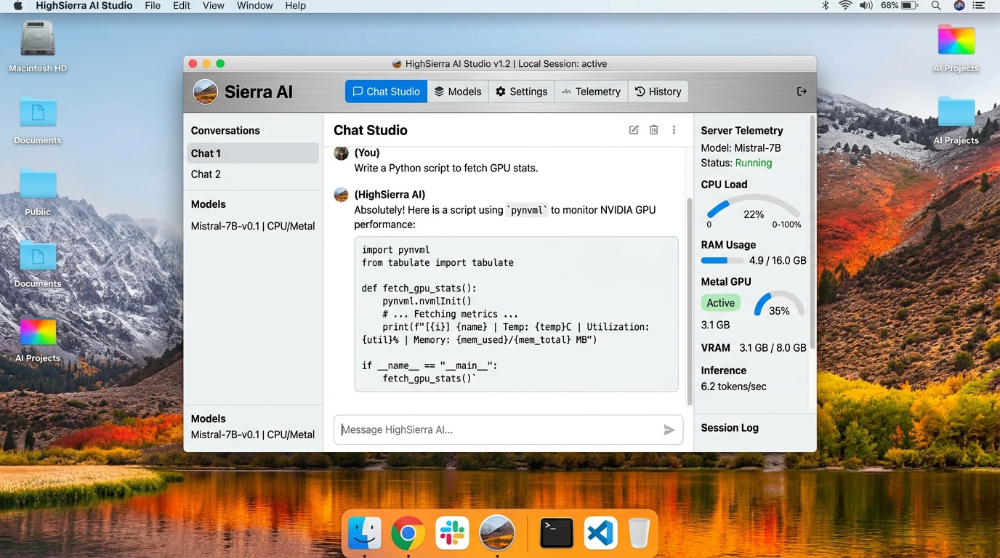

# 🏔️ HighSierra AI Studio



> **Experience the elegance of macOS 10.13 High Sierra paired with cutting-edge AI engineering.**  
> HighSierra AI Studio brings together cloud-hosted Google Gemini intelligence and locally accelerated quantized GGUF models directly to a meticulously crafted macOS High Sierra desktop interface.

---

## 📑 Table of Contents

- [Overview](#-overview)
- [Key Features](#-key-features)
- [Design Highlights](#-design-highlights)
- [Architecture & Tech Stack](#-architecture--tech-stack)
- [Getting Started](#-getting-started)

---

## 📖 Overview

**HighSierra AI Studio** is a full-featured, retro-modern desktop workstation built for developers, AI enthusiasts, and power users who appreciate classic macOS design principles alongside state-of-the-art machine learning capabilities.

Engineered with authentic High Sierra visual chrome—including brushed metal gradients, translucent menu bars, precise traffic light window controls, and native audio soundscapes—the app delivers a unified workspace for multi-model AI chatting, local GGUF server monitoring, persona customization, and interactive terminal execution.

---

## ⚡ Key Features

- **💬 Multi-Engine Chat Studio**
  - **Cloud & Local Inference**: Seamlessly switch between Google Gemini models and local Metal 2 accelerated quantized LLMs.
  - **Live Token Usage Counter**: Real-time prompt token estimation with dynamic percentage gauges and context window indicators.
  - **Voice Dictation**: Built-in Web Speech API microphone dictation for hands-free prompt composition.
  - **Session Export & Import**: Save full chat transcripts as `.json` or `.txt` files and import previous conversations effortlessly.
  - **Interactive Code Blocks**: Code snippet highlighting with one-click terminal execution.

- **🤖 Local Model Hub & Server Management**
  - Real-time GGUF model downloader and quantization manager (Q4_K_M, Q8_0, FP16).
  - Metal 2 GPU memory allocation, tile shading options, and context size tuners.
  - One-click server boot with live HTTP API endpoint logging.

- **📊 System Activity Monitor**
  - High-precision telemetry metrics for CPU, VRAM, RAM, and Metal GPU tile compute.
  - Interactive resource graphs and process kill manager.

- **🎭 Persona Studio**
  - Customizable system personalities (Developer, Creative Writer, HighSierra System Architect, Research Scientist).
  - Adjustable temperature, top-P nucleus, and system prompt parameters.

- **💻 HighSierra Terminal Shell**
  - Built-in terminal emulator supporting shell command execution, system audits, and code testing.

---

## 🎨 Design Highlights

- **Authentic macOS 10.13 High Sierra Aesthetic**:
  - Translucent frosted glass top menu bar with live clock and battery metrics.
  - Classic High Sierra metallic titlebars (`#e8e8e8` to `#cecece`) with rounded-xl window framing.
  - True-to-life traffic light window buttons (`#ff5f57`, `#ffbd2e`, `#28c940`) with hover iconography.
  - Dynamic wallpaper switcher featuring Lake, Sunset, Snow, Granite, and Deep Space themes.
- **Micro-Interactions & Audio Feedback**:
  - Motion spring entry animations on chat bubbles and window controls.
  - Retro macOS UI sound effects for window actions, prompt sending, and completion chimes.
- **Fluid & Responsive Layout**:
  - Compact macOS segmented tab controls and collapsible sidebars with high-contrast accessibility.

---

## 🛠️ Architecture & Tech Stack

- **Frontend**: React 18, TypeScript, Tailwind CSS, Motion (`motion/react`), Lucide Icons
- **Audio Engine**: Web Audio API synthesized macOS soundscapes
- **AI Acceleration**: Google Gemini 2.5 Flash SDK & Local GGUF Metal 2 pipeline
- **Build System**: Vite & ESBuild CJS bundler

---

## 🚀 Getting Started

1. **Install Dependencies**:
   ```bash
   npm install
   ```

2. **Start Development Server**:
   ```bash
   npm run dev
   ```

3. **Build for Production**:
   ```bash
   npm run build
   ```
